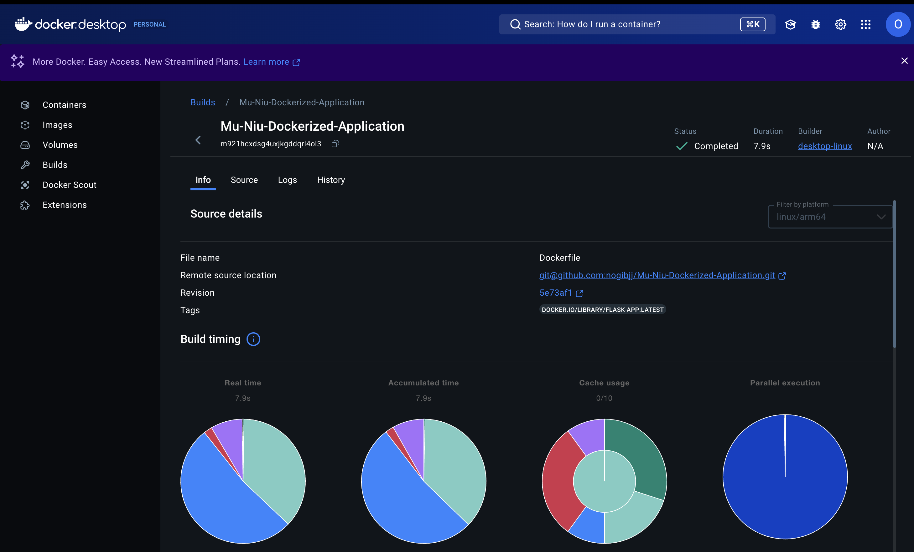

[](https://github.com/nogibjj/Mu-Niu-Dockerized-Application/actions/workflows/hello.yml)

# Mu-Niu-Dockerized-Application

A simple Flask web application that provides motivational workout reminders. The app is containerized using Docker and can be deployed locally or in any containerized environment.

## Features

- **Motivational Reminders**: Displays motivational messages to encourage users to work out.
- **Interactive Button**: Users can click "Motivate Me" to receive a random motivational message.
- **Responsive Design**: Aesthetic UI with a modern color theme.
- **Dockerized**: Easily build, run, and deploy the application using Docker.

### How It Works
- When the app starts, it displays a motivational message.
- Users can click the "Motivate Me" button to get new motivational messages.


---

## Requirements

- Python 3.9 or higher
- Docker (optional for containerized deployment)

---

## Getting Started

### 1. Clone the Repository

```bash
git clone https://github.com/your-username/flask-workout-reminder.git
cd flask-workout-reminder
```

### 2. Build Docker Image

```bash
docker build -t flask-app .
```





### 3. Run Container

```bash
docker run -d -p 5001:5000 --name flask-app-container flask-app
```


### 4. Access the App

Open your browser and navigate to http://localhost:5001


### Quotes Corpus


### Makefile Commands

| Command               | Description                                |
|-----------------------|--------------------------------------------|
| `make image_show`     | Show available Docker images.             |
| `make container_show` | Show running Docker containers.           |
| `make install`        | Install Python dependencies.              |
| `make run`            | Run the Flask app locally.                |
| `make login`          | Log in to Docker Hub.                     |
| `make build`          | Build and push the Docker image.          |
| `make docker-run`     | Run the Docker container.                 |
| `make stop`           | Stop all running containers.              |
| `make clean`          | Clean up containers and images.           |
| `make check-port`     | Check if the app's port is in use.        |
| `make logs`           | View container logs.                      |
| `make dev`            | Build and run the app in a container.     |
